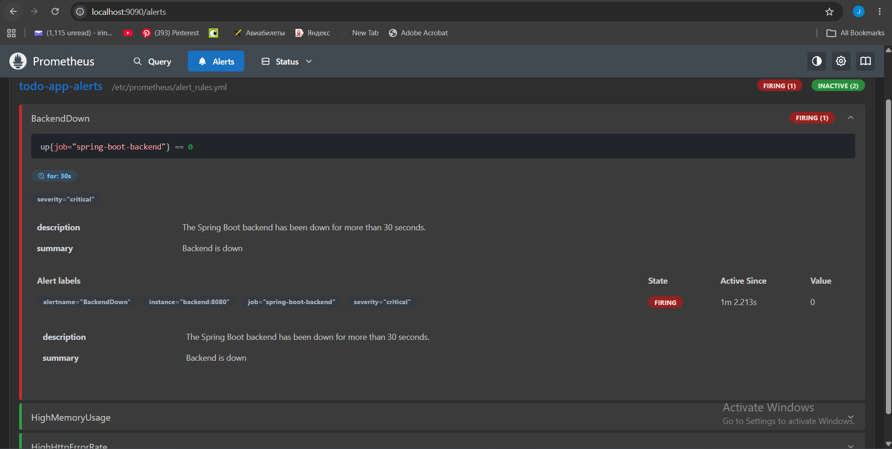
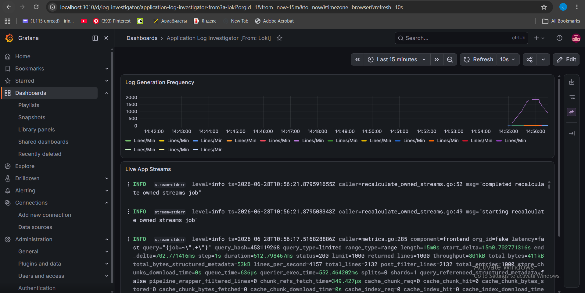
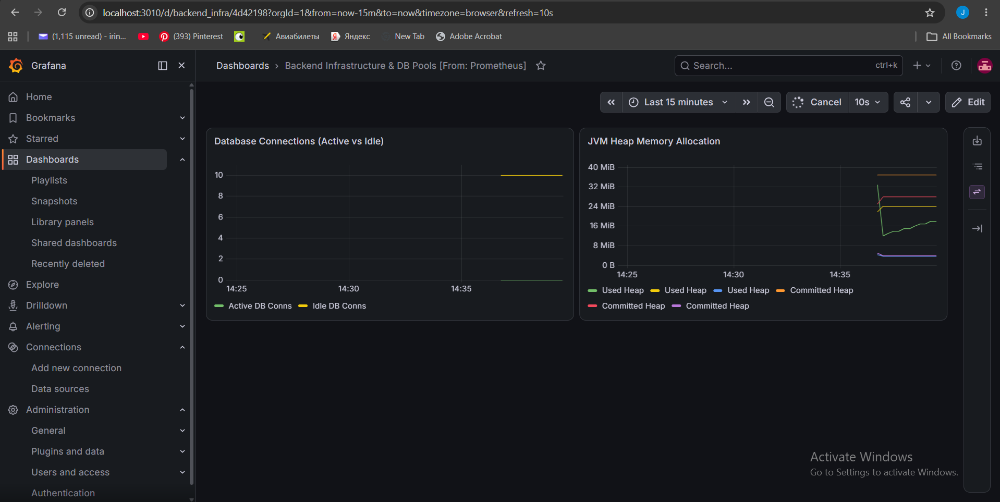
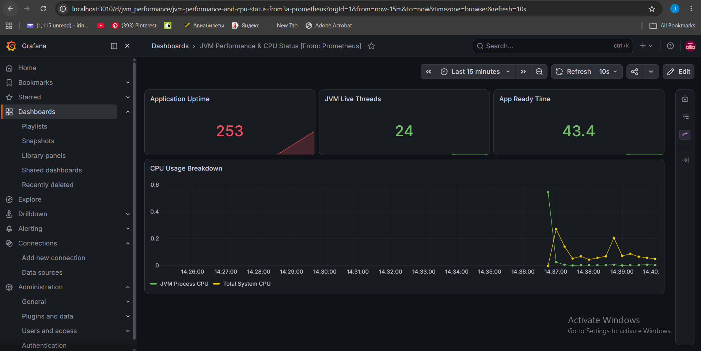

# Todo List App — Final DevOps Project

A full-stack Todo List application built with Spring Boot and Next.js, featuring a complete DevOps pipeline with CI/CD, monitoring, logging, alerting, security scanning, and automated environment setup.

---

## Table of Contents

- [Project Architecture](#project-architecture)
- [Deployment Workflow](#deployment-workflow)
- [Environment Setup](#environment-setup)
- [Security Implementation](#security-implementation)
- [Monitoring and Logging](#monitoring-and-logging)
- [Reliability Improvements](#reliability-improvements)
- [Screenshots](#screenshots)

---

## Project Architecture

```
Final Project DevOps/
├── backend/                  # Spring Boot REST API (Java 21)
│   ├── src/
│   ├── Dockerfile
│   └── pom.xml
├── frontend/                 # Next.js 16 frontend (TypeScript + Tailwind)
│   ├── src/
│   ├── Dockerfile
│   └── next.config.ts
├── monitoring/
│   ├── prometheus/
│   │   ├── prometheus.yml    # Scrape config — scrapes /actuator/prometheus every 15s
│   │   └── alert_rules.yml   # Three alerting rules: BackendDown, HighMemory, HighErrorRate
│   ├── grafana/
│   │   └── provisioning/     # Auto-provisioned datasources (Prometheus + Loki)
│   └── loki/
│       ├── loki-config.yml       # Loki log storage config (24h retention)
│       └── promtail-config.yml   # Collects Docker container logs → ships to Loki
├── scripts/
│   ├── health-check.sh       # Pings Vercel + Railway URLs, reports UP/DOWN
│   ├── rollback.sh           # Triggers Vercel rollback via CLI
│   └── setup.sh              # Single-command local environment setup
├── .github/
│   └── workflows/
│       ├── ci.yml            # CI: build, lint, npm audit, Trivy, secrets scan
│       └── cd.yml            # CD: Vercel deploy with rolling update + auto rollback
└── docker-compose.yml        # Orchestrates all 7 services locally
```

### Stack

| Layer | Technology |
|---|---|
| Frontend | Next.js 16, TypeScript, Tailwind CSS |
| Backend | Spring Boot 4.1, Java 21, JPA |
| Database | PostgreSQL 17 |
| Monitoring | Prometheus + Grafana |
| Logging | Loki + Promtail |
| CI/CD | GitHub Actions |
| Deployment | Vercel (frontend) + Railway (backend + DB) |
| Containerization | Docker + Docker Compose |

### Data Flow

```
Next.js Frontend (:3000)
        │
        ▼
Spring Boot Backend (:8080)
        │
        ├─ /actuator/prometheus ──► Prometheus (:9090) ──► Grafana (:3010)
        │                                │
        │                          alert_rules.yml
        │                    (BackendDown / HighMemory / HighErrorRate)
        │
        └─ stdout logs ──► Promtail ──► Loki (:3100) ──► Grafana
```

---

## Deployment Workflow

### CI/CD Pipeline

Every push to `main` triggers the full pipeline automatically. No manual steps required.

**CI (ci.yml) — runs on every push and pull request:**
1. Install dependencies and build the Next.js frontend
2. Run ESLint to catch code quality issues
3. Run `npm audit` for frontend dependency vulnerability scanning
4. Run Trivy filesystem scan on the frontend directory
5. Run Trivy secrets scan across the entire repository
6. Run Trivy config scan on Dockerfiles and docker-compose.yml

**CD (cd.yml) — runs only after CI passes:**
1. Pulls Vercel production environment configuration
2. Builds the Next.js production bundle via Vercel CLI
3. Deploys to Vercel using rolling update strategy
4. If deploy fails, the `rollback` job automatically triggers `vercel rollback`

The CD pipeline only runs on pushes to `main`, not on pull requests — ensuring only reviewed, passing code reaches production.

### Deployment Targets

| Service | Platform | URL |
|---|---|---|
| Frontend | Vercel | https://final-project-dev-ops.vercel.app |
| Backend | Railway | https://final-project-devops-production.up.railway.app |
| Database | Railway (PostgreSQL) | managed |

### Rolling Update Strategy

Vercel deploys new versions gradually — the new deployment becomes live only after it is built and verified. The previous version stays live until the new one is ready. If the deploy step fails, the `rollback` job in `cd.yml` automatically triggers `vercel rollback` to restore the previous working version instantly with zero downtime.

---

## Environment Setup

### Prerequisites

- Docker Desktop
- Node.js 20+
- Git

### Quick Start (Single Command)

```bash
# Clone the repository
git clone https://github.com/PhkhakadzeJumber/final-project-DevOps.git
cd final-project-DevOps

# Run the automated setup script
./scripts/setup.sh
```

The `setup.sh` script automatically:
1. Checks that Docker Desktop is installed and running
2. Checks that Node.js 20+ is installed
3. Installs all frontend npm dependencies
4. Builds and starts all 7 services with Docker Compose in detached mode

No manual configuration is needed. The script handles everything from a fresh clone to a fully running stack.

### Services After Setup

| Service | URL | Credentials |
|---|---|---|
| Frontend | http://localhost:3000 | — |
| Backend API | http://localhost:8080/api/todos | — |
| Actuator Health | http://localhost:8080/actuator/health | — |
| Prometheus | http://localhost:9090 | — |
| Grafana | http://localhost:3010 | admin / admin |
| Loki | http://localhost:3100/ready | — |

### Manual Start

```bash
docker compose up --build
```

### Stop and Clean

```bash
docker compose down -v
```

### Health Check

```bash
./scripts/health-check.sh
```

---

## Security Implementation

Security is integrated directly into the CI pipeline and runs automatically on every push to `main`. All checks are non-blocking (`exit-code: 0`) — they report findings without failing the build, which is the appropriate approach for a development project.

### 1. Frontend Dependency Scanning

`npm audit` checks all Node.js packages against the npm advisory database for known CVEs. Trivy performs an additional deep filesystem scan of the `frontend/` directory for vulnerable packages.

### 2. Secrets Scanning

Trivy scans the entire repository on every push for accidentally committed secrets, API keys, tokens, and passwords. The `backend/` and `frontend/node_modules` directories are excluded to avoid false positives from dependency files.

### 3. Docker and IaC Security Scanning

Trivy config scan checks all Dockerfiles and `docker-compose.yml` for security misconfigurations — such as containers running as root, exposed sensitive ports, or missing health checks.

### Security Tools Used

| Tool | Purpose | Free |
|---|---|---|
| Trivy | Filesystem, secrets, and IaC config scanning | ✅ |
| npm audit | Node.js package CVE scanning | ✅ |

---

## Monitoring and Logging

### Monitoring (Prometheus + Grafana)

Prometheus scrapes metrics from the Spring Boot backend every 15 seconds via the `/actuator/prometheus` endpoint, which is exposed by the Micrometer library added to `pom.xml`. Grafana auto-provisions Prometheus and Loki as datasources on startup via the `monitoring/grafana/provisioning/` directory.

**Metrics available in Grafana:**
- JVM heap memory used vs committed (MiB)
- Active and idle database connections (HikariCP)
- Application uptime (seconds)
- JVM live thread count
- CPU usage breakdown (JVM process vs total system)

**Grafana Dashboards imported:**
- **JVM Performance & CPU Status** — application uptime, thread count, CPU usage
- **Backend Infrastructure & DB Pools** — database connections, heap memory

### Alerting

Three alert rules are defined in `monitoring/prometheus/alert_rules.yml` and evaluated by Prometheus every 15 seconds:

| Alert | Condition | Duration | Severity |
|---|---|---|---|
| BackendDown | `up{job="spring-boot-backend"} == 0` | 30s | Critical |
| HighMemoryUsage | JVM heap > 85% | 1m | Warning |
| HighHttpErrorRate | 5xx rate > 0.1/sec | 1m | Critical |

To trigger the `BackendDown` alert for demonstration:
```bash
docker stop todolist_backend
# Wait 30 seconds, then check http://localhost:9090/alerts
docker start todolist_backend
```

### Logging (Loki + Promtail)

Promtail reads Docker container log files directly from `/var/lib/docker/containers/` and ships them to Loki in real time. Grafana queries Loki using LogQL to display and filter logs across all services in one place.

**Log retention:** 24 hours — logs are stored temporarily and cleared on container restart to minimize disk usage.

**Example LogQL queries in Grafana Explore:**
```
{container=~".+"}              # All containers
{container="todolist_backend"} # Backend only
{stream="stderr"}              # Error streams only
```

---

## Reliability Improvements

### Health Checks

**Script-based:** `./scripts/health-check.sh` pings both the Vercel frontend URL and the Railway backend URL and reports HTTP status codes with green/red indicators.

**Container-level:** The `postgres` service has a Docker health check (`pg_isready`) that prevents the backend from starting until the database is fully ready, avoiding startup race conditions.

**Application-level:** Spring Boot Actuator exposes `/actuator/health` with detailed status of the application and database connection.

### Rollback Procedure

**Automatic rollback:** If the CD pipeline deploy step fails, the `rollback` job in `cd.yml` automatically runs `vercel rollback` to restore the previous production deployment instantly.

**Manual rollback:**
```bash
export VERCEL_TOKEN=your_token_here
./scripts/rollback.sh
```

### Failure Recovery

All Docker services use `restart: unless-stopped` — any container that crashes will automatically restart without manual intervention. Log sizes are capped with `max-size` and `max-file` limits to prevent disk exhaustion.

### Service Availability

| Service | Availability |
|---|---|
| Frontend (Vercel) | 99.99% SLA |
| Backend (Railway) | Managed uptime, auto-restart |
| Local DB | Docker health check + auto-restart |

---

## Screenshots

### Prometheus Alert Firing (BackendDown)

*BackendDown alert in FIRING state after stopping the backend container — severity=critical, active for 1m 2.213s*

### Grafana — Loki Log Dashboard

*Application Log Investigator dashboard showing live log streams from all Docker containers and log generation frequency over time*

### Grafana — Backend Infrastructure & DB Pools

*Prometheus-backed dashboard showing active vs idle database connections and JVM heap memory allocation in real time*

### Grafana — JVM Performance & CPU Status

*Application uptime (253s), JVM live threads (24), app ready time (43.4s), and CPU usage breakdown (JVM process vs total system)*